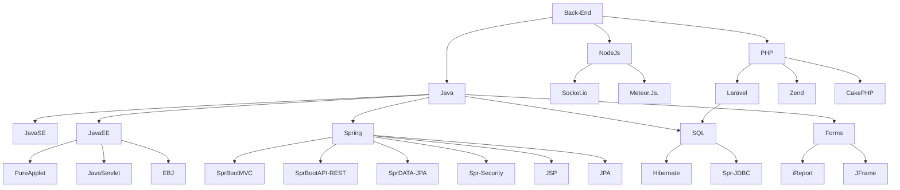

<h1 align="center">Free Style</h1><p align="center">
Bienvenido a mi repositorio de codigo libre, se encuentran todos mis proyectos de inicio a fin, tanto proyectos universitarios como proyectos de interes personal.
  
<div align="center">
<a href="https://www.facebook.com/LinderCasasM" target="_blank"></a>
<a href="https://x.com/home" target="_blank"></a>  
<a href="https://www.tiktok.com/@lindercasas" target="_blank"></a>
<a href="https://www.instagram.com/casaslinder/" target="_blank"></a> 

[](https://www.linkedin.com/in/linder-casas-3820a0290/)
[](mailto:lindercasas@gmail.com)
</div>


<!-------------------------------------------------------------------------------------------->

# 📈 Statistics
[](https://github.com/ashutosh00710/github-readme-activity-graph)


<!-------------------------------------------------------------------------------------------->

# 📊 Stats
<div align="center">  
   
  
</div>

<p align="center">
 
</p>

<!-------------------------------------------------------------------------------------------->

# 👨‍💻 Your Skills
### Frontend

```mermaid
graph TD;
    Front-End-->HTML5;
    Front-End-->CSS3;
    Front-End-->JavaScript;
    Front-End-->TailwindCss
    Front-End-->Angular;
    Front-End-->JSON;
    Front-End-->TypeScript;
    classDef frontEnd fill:#1c1c1c,stroke:#ffffff;
    class HTML5,CSS3,JavaScript,TailwindCss,Angular,JSON,TypeScript frontEnd;
```



<!-------------------------------------------------------------------------------------------->

### Backend

<!-------------------------------------------------------------------------------------------->

### Full Stack
<p align="center">
 
   
   
    
   
  
  
   
   
   
<p/>


<!-------------------------------------------------------------------------------------------->
 ```geojson
{
  "type": "FeatureCollection",
  "features": [
    {
      "type": "Feature",
      "id": 1,
      "properties": {
        "ID": 0
      },
      "geometry": {
        "type": "Polygon",
        "coordinates": [
          [
              [-78,-11.9],
              [-76.9,-11.9],
              [-76.9,-11.9],
              [-78,-11.9],
              [-78,-11.9]
          ]
        ]
      }
    }
  ]
}
```

<!-------------------------------------------------------------------------------------------->
  
# 👁️ Views
<div align="center">
<br><p align="centre"><b>Visitors Count 👽 </b></p>  
<p align="center"></p> 
<br>
</div>

<!-------------------------------------------------------------------------------------------->
# 🐛 Snyken

