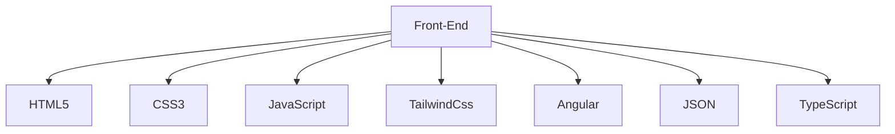
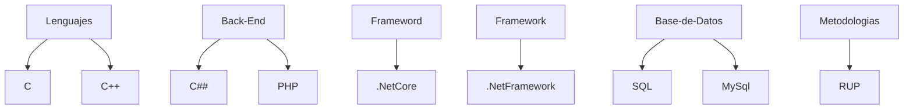

# 👽 FreeStyle
Bienvenido a FreeStyle, un estilo libre de codigo para todos.

  
 

<a href="https://www.instagram.com/👽/" target="_blank"> 

# 📈 Statistics

# 📊 Stats

  
   
  
  

 

 

# 👨‍💻 Your Skills
### Frontend

### Backend

### FullStack

 
   
   
    
   
  
  
   
   
   

# 👁️ Views

 
<b>Visitors Count 👽 </b>
  

 
 

